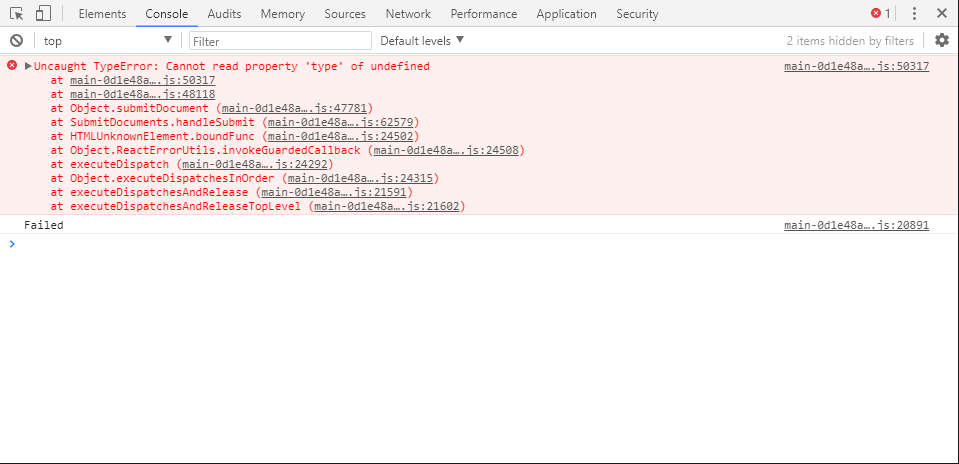

Este artigo é parte de uma série de 2 artigos sobre "O que é e porque utilizar ReasonML?"
- [Parte 1](https://blog.blumenaujs.org/o-que-e-e-porque-utilizar-reasonml-parte-1)
- [Parte 2](https://blog.blumenaujs.org/o-que-e-e-porque-utilizar-reasonml-parte-2)

## Introdução

Bom, algum tempo se passou desde a primeira parte deste artigo. Ocorreram muitas mudanças desde o primeiro post e eu acabei deixando de lado essa série.
Nesta segunda parte, vou dar continuação ao artigo anterior, com objetivo de dar uma visão geral sobre o que é ReasonML e especificamente neste artigo,
irei abordar quais as vantagens dele em relação a outras alternativas, como o TypeScript. 

Se você não leu a primeira parte deste artigo, pare, leia, e volte aqui para continuar. A primeira parte contém informações muito 
importantes sobre ReasonML e vai ser crucial para entender os tópicos que irei abordar aqui neste artigo.

Esta é a segunda parte da série, em breve quero começar outra que será _"Como dar os primeiros passos 
com ReasonML e React"_. Se tudo der certo, também devo lançar alguns vídeos no canal do [YouTube](https://www.youtube.com/channel/UCej3xR0REyuvYYAFz0SbswA) 
da [Lukin](https://lukin.co), onde vou passar o mesmo conteúdo sobre como iniciar em Reason com React, só que em formato de vídeo.

Bom, dado esses avisos, vamos para o que interessa.

## Por que ReasonML?

Para responder essa pergunta, vou precisar _"cutucar algumas feridas"_ dos desenvolvedores JavaScript. Vejo uma certa resistência de 
uma parte da comunidade em aceitar que JavaScript tem "características" (problemas de design)  que podem trazer complicações quando falamos de 
colocar softwares em produção e trabalhar em projetos com bases de código consideravelmente grandes e com equipes maiores.

Neste  [artigo]([https://rollbar.com/blog/top-10-javascript-errors/) da Rollbar, 
uma empresa que trabalha com soluções para tracking de erros em aplicações, mostra através de dados coletados da sua plataforma, os _10 erros mais 
comuns em aplicações JavaScript_. O que se pode observar é que dos 10 erros listados, 7 deles são o que conhecemos por _TypeErrors_.

O fato de JavaScript ser uma linguagem dinamicamente e fracamente tipada, 
pode e provavelmente vai te causar problemas em produção em algum momento. Qualquer desenvolvedor JavaScript com uma certa experiência, certamente já passou pela seguinte situação:

*Recebeu um ticket de erro e para entender o problema e o que estava ocorrendo, abriu o console 
e se deparou com a seguinte mensagem:*



Isso apesar de ser comum, não deveria ser considerado normal pelos desenvolvedores JavaScript, que com o tempo, acostumaram-se com esse tipo de 
erro no ambiente de produção e principalmente durante o desenvolvimento. 

Desenvolvedores JavaScript, estão sempre lidando com esse tipo 
de situação, e o que começou como uma simples _"característica"_ da linguagem, se tornou uma dor de cabeça.


## Possíveis soluções

Bom, existem algumas formas de você evitar que esses erros aconteçam. Uma delas e a mais comum é  *programar de forma defensiva,* o que é péssimo, 
pois no fim, você acaba se preocupando com coisas que não necessariamente você deveria se preocupar, como: _validar se você está somando valores do 
tipo *number* com *strings*, tentar executar um *.map* em algo que não é um *array*_ e entre outras situações comuns para desenvolvedores JavaScript.
Por outro lado, existe um esforço em criar ferramentas que cuidem desses detalhes para você, por exemplo linters ou superseTypeScript como o TypeScript. 
Certamente utilizar essas ferramentas ou superseTypeScript, vão te ajudar a evitar a passar por esses erros de runtime. 

Nesse momento, você que está lendo este artigo, se é adepto e já trabalha com TypeScript nos seus projetos, deve estar pensando que ele já é suficiente para
evitar esse tipo de erro mencionado acima. Porém, mesmo com TypeScript, você provavelmente vai acabar se deparando com problemas semelhantes, tendo em vista
que o mesmo é apenas um superset para o JavaScript e foi totalmente pensado em permitir uma adoção gradual de sua utilização em projetos. Isso significa que,
provavelmente em algum momento você precisará utilizar o famigerado _any_ do TypeScript, em suas aplicações.

Entendo a motivação da equipe do TypeScript e, estou ciente de que ele foi pensado em ser mais flexível desde o início. Meu ponto aqui é, TypeScript
não resolve de fato todos os problemas relacionados a tipos e outras coisas mais, que nos deparamos ao escrever aplicações JavaScript.

TypeScript é apenas um superset, portanto, ele apenas adiciona uma série de features ao JavaScript, e o sistema de tipos é uma dessas features.
Um dos maiores contrastes entre ReasonML e TypeScript, certamente é o sistema de tipos. De forma bem superficial, podemos dizer que TypeScript, apenas
tenta adicionar tipos ao JavaScript. Isso torna a adoção de TypeScript muito fácil aos desenvolvedores JavaScript. Porém, por ser um superset, ele possui
algumas desvantagens em relação a uma linguagem totalmente nova, já que ele herda também os problemas de design que JavaScript possui. 

Pensando que o sistema de tipos de TypeScript foi projetado para se comportar de forma mais flexível e gradual, ele não vai te dar muitas garantias, você realmente
não pode confiar 100% no seu sistema de tipos, o que é péssimo, já que eliminar erros envolvendo o uso incorreto de tipos em compilação, é uma das maiores vantagens ao se utilizar linguagens estaticamente tipadas.

Já ReasonML, traz uma abordagem diferente, ele foi criado com o propósito de tornar OCaml uma linguagem mais familiar aos desenvolvedores JavaScript.
Por ser apenas uma sintaxe nova ao OCaml, Reason herda todas as features e decisões de design de uma linguagem funcional, compilada, _battle tested_, com um sistema de tipos poderoso e que
evoluiu constantemente nos últimos 25 anos.

## ReasonML e TypeScript

A seguir, vou mostrar como é simples e elegante utilizar tipos em ReasonML, já que praticamente em nenhum momento é necessário anotar os tipos. 
Isso, de longe é uma das maiores vantagens de se utilizar ReasonML, principalmente quando se comparado ao TypeScript, que apesar de possuir um certo nível 
de inferência, ainda sim é muito inferior ao que vemos em Reason. 

Além disso vou abordar alguns tópicos e técnicas presentes em ReasonML e tentar exibir algo equivalente em TypeScript, para mostrar de fato
as vantagens que Reason tem em relação a ele. Algumas coisas como pattern matching e varianTypeScript, irei abordar de forma superficial. Porém, vou deixar
um material adicional no final do artigo, que com certeza vai te ajudar entender muito mais sobre esses tópicos. Em artigos futuros, pretendo abordar esses
conceitos e técnicas, mas para isso preciso passar essa introdução a Reason.

## 1. Tipos e Inferência de tipos

Como eu disse anteriormente, o sistema de tipos de OCaml é incrível e muito poderoso. Ele permite você modelar seu software de uma maneira muito 
clara e sem tirar a elegância da sua sintaxe. Como ReasonML é só uma sintaxe para OCaml, ele herda também o sistema de tipos. 

Não vou falar profundamente sobre como o sistema de tipos de OCaml/ReasonML funciona, daria para fazer uma série inteira falando somente sobre isso. 
Meu objetivo aqui é mostrar a parte prática e o contraste disso com JavaScript e TypeScript. 

Bom, vamos a alguns exemplos:

### 1.1 Tipos básicos

Nesse primeiro tópico não há muito o que falar. Tipos básicos como string, boolean, int e float, são bem simples de compreender em relação ao que está presente em TypeScript.
Veja alguns exemplos:

__ReasonML__
```reason

// string
let name = "Alonzo";

// boolean
let isAdmin = true;

// int
let age = 22;

// float
let price = 20.5;

```

__TypeScript__
```typescript
// string
const name = "Alonzo";

// boolean
const isAdmin = true;

// number
const age = 22;

// number
const price = 20.5;
```

Aqui podemos notar algumas semelhanças e diferenças. A primeira é que ambos possuem inferência para esse nível de atribuição de tipos. O compilador do TypeScript assim como o de Reason, consegue
inferir e identificar que o tipo de uma varíavel, através o valor que lhe é atribuída. A primeira diferença se dá no tipo __number__ do TypeScript e nos tipos, __int__ e __float__ de Reason.
Em OCaml há distinção entre __int__ e __float__. No momento de atribuir um valor float, você apenas adiciona um __.__ ao valor. No mais as coisas são bem parecidas e tendem a não ter muitas diferenças.


### 1.2 Records

Em Reason não há interfaces como em TypeScript, ao invés disso temos algo bem-parecido, mas muito mais poderoso, que são os *Records* 
e que por padrão já são imutáveis, assim como a maior parte das outras estruturas de dados de ReasonML.

__ReasonML__
```reason
type student = {
 name: string,
 age: int
};
```

__TypeScript__
```typescript
interface Student {
 name: string,
 age: number
}
```

Até aqui quase nenhuma diferença. Vamos analisar dois exemplos que mostram de forma clara as vantagens de Reason:

__ReasonML__
```reason
type student = {
 name: string,
 age: int
};

let someStudent = {
 name: "Alonzo Church",
 age: 22
};
```

__TypeScript__
```typescript
interface Student {
 name: string,
 age: number
}

const someStudent: Student = {
 name: "Alonzo Church",
 age: 22
}
```

Oberve que, em Reason em nenhum momento precisei informar ao compilador que a variável __someStudent__, é do tipo __student__.
Já em TypeScript, para de fato informar ao compilador que a variável é do tipo __Student__, tive que anotar o tipo. Se não feita esta anotação,
o compilador irá entender que __someStudent__ é do tipo __{ name: string, age: number }__ e não do tipo __Student__, como é declarado acima, através de uma interface.

Em TypeScript, se a variável __someStudent__, não possuir a anotação de que ela é do tipo __Student__, é possível declarar o objeto de maneira incorreta. Por exemplo,
poderíamos atribuir a __age__ uma string e o compilador não teria como nos dizer que cometemos um erro. Veja:

__TypeScript__
```typescript
interface Student {
 name: string,
 age: number
}

// Sem anotação
const someStudent = {
 name: "Alonzo Church",
 age: "22"
}
```

Nesse exemplo, onde não há anotação de tipo para __someStudent__, o compilador do TypeScript não consegue identificar que __someStudent__ é do tipo __Student__, portanto nos
permite cometer um erro, atribuindo a __age__ um valor do tipo string. Para restringir e extrair o melhor do compilador, seria necessário anotar o tipo, como fizemos no primeiro exemplo.

Já em Reason, isso é responsabilidade do compilador. Mesmo que eu não anote o tipo, o compilador sabe de qual tipo se trata aquele valor que está sendo atribuído.
Logo, se  tentarmos atribuir a __age__ um valor do tipo __string__, o compilador nos dará a seguinte mensagem:

```javascript
  // We've found a bug for you!
  
  6 │ let someStudent = {
  7 │  name: "Alonzo Church",
  8 │  age: ->"22"<-
  9 │ };
  
  This has type:
    ->string<-
  But somewhere wanted:
    int
```

Além disso, Reason é muito mais rígido do que TypeScript quando se trata de declarar e trabalhar com records. O primeiro ponto, é a imutabilidade.
Em TypeScript, seria simples alterar qualquer valor de um objeto. Já em Reason, ao tentar alterar o valor de __name__, ele nos dará o seguinte erro:

```javascript
 // We've found a bug for you!
   9 │ };
  10 │ 
  11 │ someStudent.name = "Church";
  
  The record field name is not mutable
```

Ou seja, record é uma estrutura de dados imutável por padrão, o que é um grande ganho, já que trabalhar com imutabilidade traz inúmeros benefícios.

Outro ponto importante sobre os records, é que não é possível atribuir a uma variável um valor do tipo record, sem antes declarar ao compilador que aquele tipo existe.
Isso significa que, se tirarmos o trecho onde declaramos o tipo __student__, o compilador nos dará a seguinte mensagem de erro:

```javascript
  // We've found a bug for you!
  1 │ 
  2 │ let someStudent = {
  3 │  name: "Alonzo Church",
  4 │  age: 22
  5 │ };
  
  The record field "name" can't be found.
```

Observe que o compilador disse que não encontrou uma propriedade chamada "name". A princípio essa mensagem pode ser um pouco estranha. Mas, isso acontece, por conta 
da forma como Reason identifica e deduz os tipos. Para identificar um tipo, sem que ele seja declarado, o compilador sempre irá analisar a expressão que se segue 
após o __=__ . Analisando a expressão `{ name: "Alonzo Church", age: 22 }`, Reason identifica que está atribuindo um valor do tipo __record__ e sai em busca
de _tipos declarados_ que se encaixem exatamente com os mesmos _nomes_ (name) e _tipos_ (string) das propriedades atribuídas a variável. Caso ele não encontre nenhum tipo declarado que corresponda
ao que foi atribuído como valor a variável, ele dará como mensagem de erro que não encotrou _X_ propriedade (no nosso caso o name), declarado como _field_ de um 
record.

Embora possa parecer uma coisa ruim não poder atribuir valores do tipo record, sem ter que criar um tipo, isso na verdade é uma vantagem. Reason, diferente de TypeScript,
não utiliza o sistema de tipos como só mais uma feature. Ele utiliza o sistema de tipos para te guiar a modelar seu software, de maneira que, você sempre denomine
e atribua tipos aos valores que você está manipulando. O sistema de tipos irá te guiar sempre e isso é uma enorme vantagem.


### 1.3 Listas e Arrays

Quando se fala de listas e arrays em Reason, algumas coisas precisam ser esclarecidas para quem está conhecendo OCaml ainda. No artigo anterior, mencionei uma diferença
na sintaxe de declarações entre listas e arrays. O que não mencionei e deixei para tratar neste artigo, é a diferença prática entre as duas. Na tabela abaixo, é possível identificar
algumas diferenças e casos de uso melhores para cada uma das estruturas de dados:

<table class="framed">
  <thead>
  <tr>
  <th></th>
  <th>Listas</th>
  <th>Arrays</th>
  </tr>
  </thead>
<tbody>
  <tr>
  <td>Tamanho</td>
  <td>Pequenas a Médias</td>
  <td>Pequenas a Grandes</td>
  </tr>
  <tr>
  <td>Redimensionável</td>
  <td>Flexível</td>
  <td>Tamanho fixo</td>
  </tr>
  <tr>
  <td>Mutável</td>
  <td>Não</td>
  <td>Sim</td>
  </tr>
  <tr>
  <td>Form de acessar elementos</td>
  <td>Desestruturação</td>
  <td>Index</td>
  </tr>
  <tr>
  <td>Casos de uso mais rápido</td>
  <td>Prefixar e Remover</td>
  <td>Ler e Adicionar elementos</td>
  </tr>
</tbody>
</table>

Em contraste com TypeScript existe uma diferença crucial a ser mencionada. LisTypeScript e arrays, só podem armazenar elementos do mesmo __tipo__. Em TypeScript, encontramos essa flexibilidade, como podemos ver nos exemplos abaixo:

__TypeScript__
```typescript
const names = ["Alonzo", 22]
```

__ReasonML__
```reason
let names = ["Alonzo", 22];
```
Se tentarmos executar o exemplo acima, o compilador do Reason nos dará a seguinte mensagem:

```javascript
  // We've found a bug for you!

  1 │ 
  2 │ let names = ["Alonzo", 22];
  
  This has type:
    int
  But somewhere wanted:
    string
```

### 1.4.Functions

Aqui está uma das maiores diferenças até o momento. Para extrair o "melhor" de TypeScript quase sempre é necessário anotar os tipos em funções.
Em ReasonML, é o inverso, dificilmente você precisará anotar os tipos nas funções. Isso é possível graças ao poderoso sistema de tipos que Reason herda de OCaml.
Através da expressão da função, Reason consegue identificar e deduzir o tipo que os parâmetros de uma função possuem e o que ela irá retornar.

Vamos a alguns exemplos:

__TypeScript__
```typescript
  // Sem anotação
  const greeting = name => "Hello " + name

  // Com anotação
  const greeting  = (name: string) => "Hello " + name
```
__ReasonML__
```reason
  let greeting = name => "Hello " ++ name;
```

Se você executar o primeiro exemplo de código, no [playground oficial do TypeScript](https://www.typescriptlang.org/play/?ssl=1&ssc=1&pln=5&pc=32#code/ATDGHsDsGcBdgOYCcCmLYEtIOAXmJAIYC2KeAfMAEQASKANveNcANQEkoBQQA), é possível ver que o parâmetro __name__, é do tipo _any_. Para que o
compilador saiba que o mesmo é do tipo string, deverá anotar o tipo como fiz na segunda linha. 

Já em Reason, não é necessário informar ao compilador qual o tipo
do parâmetro. Através da expressão, ele consegue deduzir que o tipo será __string__. E como ele faz isso? Bom, ele irá avaliar usando os seguintes passos:

- __greeting__ está recebendo um valor que é uma função que possui somente um parâmetro
- Para identificar qual o tipo desta função como um todo, é necessário identificar o tipo do parâmetro
- Analisando a primeira parte expressão __"Hello " ++__ o compilador consegue identificar que estamos tentando realizar uma concatenação com a string __"Hello "__, utilizando o operador __++__
- Analisando a segunda parte da expressão, ele sabe que o parâmetro está nessa operação de concatenação, logo, o compilador consegue identificar que o mesmo é do tipo string,
tendo em vista que só é possível concatenar um valor do tipo string, com outro valor do tipo string

A assinatura desta função ficaria assim:

```reason
let greeting: string => string;
```

## 2. Functions

Funções são features importantes em todas as linguagens e, nas funcionais, elas possuem muitas vantagens em relação a outras mais populares como JavaScript ou Java.
Em ReasonML isso não é diferente, uma das features que o tornam mais poderoso, são as funções. As funções em ReasonML e assim como em outras linguagens funcionais possuem features como 
[currying](https://reasonml.github.io/docs/en/function#currying) e [argumentos nomeados](https://reasonml.github.io/docs/en/function#labeled-argumenTypeScript), que irei abordar nos próximos trechos.

### 2.1 Argumentos nomeados
Argumentos nomeados apesar de serem pouco conhecidos por desenvolvedores JavaScript, não é algo novo. Algumas linguagens como Python e Ruby já possuem há um bom tempo.
Reason possui argumentos nomeados e quando combinados com [pipe operators](https://reasonml.github.io/docs/en/pipe-first) e currying, facilitam e muito a composição de funções. 

Para informar ao compilador que um parâmetro é nomeado, basta adicionar um __~__ antes do nome do argumento. Isso facilita na hora de executarmos uma função, já que os argumentos possuem nomes e
não é necessário passar os argumentos respeitando a ordem utilizada na declaração da função. 

Veja o exemplo abaixo:

__ReasonML__
```reason
let sayHello = (~name, ~lastname) => "Hello " ++ name ++ " " ++ lastname;

sayHello(~lastname="Church", ~name="Alonzo"); // Hello Alonzo Church
```

_Note que não precisei passar os argumentos na mesma ordem em que eles são declarados na função. De primeiro momento essa feature pode não parecer tão útil, mas se combinada a próxima, é muita poderosa._

Em TypeScript, as funções não possuem argumentos nomeados. O mais próximo disso, é um hack comum utilizado por desenvolvedores, onde ao invés de adicionar dois ou mais parâmetros a função, é utilizada somente um parâmetro 
do tipo _objeto_. Dessa forma é possível passar argumentos para a função, sem se preocupar com a ordem.

__TypeScript__
```typescript
const sayHello = ({ name, lastname }) => "Hello " + name + " " + lastname;

sayHello({ lastname: "Church", name: "Alonzo" })
```

De certa forma, é um hack aceitável. Porém extremamente limitado e que traz algumas desvantagens. Uma delas seria que o tipo do parâmetro seria sempre __any__, logo você perde a segurança de estar
passando os parâmetros com os tipos corretos. Caso você queira manter a segurança dos tipos, seria necessário criar uma interface ou anotar os tipos inline.

### 2.2 Currying

Funções em Reason podem ser aplicadas de [forma parcial](https://reasonml.github.io/docs/en/function#currying). 
Isso signifca, que podemos executar uma função e não passar todos os parâmetros de uma vez só. Veja um exemplo de como funciona aplicação parcial:

```javascript
let sum = (a, b) => a + b; // Linha  A

let addOne = sum(1); // Linha  B

addOne(2); // Linha  C
``` 

Para entender este exemplo é preciso entender que em ReasonML, uma função recebe sempre __um argumento__. Por mais que pareça passar mais de dois argumentos, o que acontece, é que na verdade uma função que recebe
mais de um argumento, utiliza somente o primeiro argumento e retorna uma outra função com o segundo argumento. Para entender melhor, vou tentar exemplificar utilizando TypeScript:

```typescript
const sum = a => b => a + b;

const addOne = sum(1);

addOne(2);

// ou

sum(1)(2);
```
Veja que nesse exemplo, estamos criando uma função que ao invés de receber __dois argumentos__, ela recebe um argumento e retorna uma outra função que recebe __um argumento__. Logo seria possível, criar uma nova função,
a partir de __sum__, uma função que sempre execute algo como:

```typescript
const addOne = b => sum(1)(b);
```

No entanto podemos fazer algo mais simples e atribuir o retorno de __sum__ a uma nova variável, já que o retorno de sum já é uma outra função. 

Em Reason, isso é algo que acontece por padrão em todas as funções.
Mesmo que você indique que uma função tem __2 argumentos__, na verdade ela sempre é entendida como uma função que recebe um argumento e retorna outra função que também recebe um argumento, e assim sucessivamente conforme a quantidade
de argumentos que for determinada na função.

Esse comportamento é o que conhecemos por currying em programação funcional. Essa é a principal feature para viabilizar composição de funções em Reason e outras linguagens funcionais.

_É possível emular este comportamento em TypeScript, mas está longe de ser tão poderoso quanto, já que toda função teria que retornar uma outra função e assim sucessivamente, e
isso implicaria na legibilidade do código._

### 2.3 Currying + Argumentos nomeados

Bom, apresentei o que são argumentos nomeados e currying e também mostrei como os utilizar de forma separada. Porém, essas duas features combinadas, são muito poderosas e vão tornar a sua vida muito fácil. 

Veja um exemplo abaixo:

```reason
let message = (~text, ~name) => text ++ " " ++ name;

let sayHello = message(~text="Hello");

let messageToAlonzo = message(~name="Alonzo");

sayHello(~name="Alonzo Church"); // Hello Alonzo Church

messageToAlonzo(~text="Hi!"); // Hi! Alonzo Church
```

Observe que combinei a aplicação parcial aos argumentos nomeados e isso me permitiu compor várias outras funções a partir de uma mesma função. Isso é uma das muitas formas de se compor funções e essa é uma das técnicas mais utilizadas por desenvolveres OCaml/ReasonML.

## 3. Pattern matching

Essa é uma das minhas features preferidas. Assim como currying, ela é muito comum em linguagens funcionais, mas bem desconhecida para desenvolvedores de linguagens _mainstream_.
O que vou apresentar nos próximos trechos, vai mudar a forma como você enxerga condicionais como __if__.

### 3.1 O que é?

_Pattern matching_, como o próprio nome diz, é a _busca por um padrão_. De primeiro momento ele vai se parecer muito com a _desestruturação_ presente em JavaScript. Mas não se engane, ele é muito mais
poderoso. 

Pattern matching é usado basicamente para dois propósitos:

- Encontrar valores presentes em estruturas de dados (matching)
- Extrair parte dos dados (destructuring) 

### 3.2 Como utilizar?

A sintaxe de pattern matching no primeiro momento, se parece muito com o `switch case` de JavaScript. Como mencionei acima, ele pode ser utilizado para encontrar dados e extrair partes de dados.
Para exemplificar a busca por um padrão de dados, vou utilizar valores do tipo int e depois mostrar exemplos com tipos mais complexos, como records.

Veja o exemplo a seguir:

__ReasonML__
```reason
let year = 1;

let message = switch year {
 | 1 => "1 ano"
 | 2 => "2 anos"
};
```

Observe atentamente o que está acontecendo neste exemplo. Após definir a variável __year__, defini uma variável __message__ que irá receber o resultado de uma expressão switch. No entanto, observe o que acontece a partir da
palavra reservada __switch__: passei a variável __year__, indicando que quero realizar uma busca por um padrão, a partir do valor desta variável. 
Nas próximas linhas, vou mapeando os possíveis valores que __year__ pode ter:
- Na primeira, caso seja o valor __1__, indico que deve retornar a string __"1 ano"__
- Na segunda, caso seja o valor __2__, indico que deve retornar a string __"2 anos"__

Essa é a forma mais simples de se utilizar pattern matching. Neste exemplo estamos usando para _encontrar um padrão_ a partir do valor de uma variável.

Se executar este código, o compilador do Reason nos dará a seguinte mensagem:

```javascript
  1 │ let year = 1;
  2 │ 
  3 │ let message = switch year {
  4 │  | 1 => "1 ano"
  5 │  | 2 => "2 anos"
  6 │ };
  
  'You forgot to handle a possible case here, for example:'
  => 0
```
_"Você esqueceu de mapear um caso aqui, por exemplo: 0"_. É exatamente isso que o compilador quer dizer, que esqueci de mapear uma possibilidade, neste caso o 0.
Vou alterar o código, para tratar este caso, executar o código e o compilador nos dará outra mensagem:

```javascript
  1 │ let year = 1;
  2 │ 
  3 │ let message = switch year {
  4 │  | 0 => "Zero"
  5 │  | 1 => "1 ano"
  6 │  | 2 => "2 anos"
  7 │ };
  
  'You forgot to handle a possible case here, for example:'
  => 3
```
Bom, a primeira vista pode ser estranho, mas faz todo sentido, as possibilidades de um valor do tipo __int__ são inúmeras, então o compilador vai sempre nos informar de que está faltando
mapear mais uma possibilidade. O nome disso é _exhaustiveness checking_ e com certeza vai te poupar alguns bugs, caso você utilize Reason em produção.

_Até aqui nada novo, TypeScript também possui um certo nível de exaustão em expressões como o switch case. Esta primeira parte foi apenas para tornar mais familiar a sintaxe
do switch e as mensagens que o compilador pode retornar._

Bom, para resolver esse warning do compilador, nós vamos utilizar a _extração_ de valores do pattern matching. Veja o exemplo abaixo:

__ReasonML__
```reason
let year = 1;

let message = switch year {
 | 0 => "Zero"
 | 1 => "1 ano"
 | value => string_of_int(value) ++ " anos"
};
```
Observe que removi a linha onde mapeava a possibilidade do valor __2__ e adicionei uma nova expressão, onde atribuo o valor de __year__ a uma variável __value__. Isso quer dizer algo como
"para qualquer valor, que não seja uma das possibilidades acima (__0__ ou __1__), quero chamá-lo de __value__" e partir disso nós podemos manipular value na expressão que se segue após __=>__.

### 3.2 Pattern matching + records

Pattern matching pode ser utilizado para qualquer estrutura de dado em ReasonML. Para mostrar como funciona a extração de dados, vou utilizar records como exemplo desta seção.

Imagine o seguinte caso: Um tipo person que possui as propriedades __name__ e __age__. Agora, pense que você possui um valor do tipo __person__ e precisa dar uma mensagem
que irá variar de acordo com o valor de __age__ e __name__. 

Veja o exemplo seguir:

```reason
type person = {
  name: string,
  age: int
};

let somePerson = {
  name: "Marcos",
  age: 22
};

let message = switch somePerson {
  | { name: "Marcos", age: 22 } => "Marcos tem 22 anos"
  | { name, age } => name ++ " : " ++ string_of_int(age)
};
```
Observe que aqui estou utilizando a _busca por um padrão (matching)_ e a _desestruturação_. Dessa forma eu posso criar condicionais de forma mais granular e acessar cada propriedade do record.

Também é possível utilizar operadores lógicos como __>__ ou __<__, através da palavra reservada __when__.

__ReasonML__
```reason
type person = {
  name: string,
  age: int
};

let somePerson = {
  name: "Marcos",
  age: 22
};

let message = switch somePerson {
  | { name: "Marcos", age } when age < 25 => "Marcos tem menos que 25 anos"
  | { name, age } => name ++ " : " ++ string_of_int(age)
};
```
Após a palavra reservada __when__, eu tenho acesso as propriedades que obtive pela desestruturação e posso utilizar para fazer alguma lógica que irá complementar o __matching__, presente
na primeira parte da expressão.

### 3.3 Considerações e contraste com TypeScript

Apesar de não ter apresentado, é possível utilizar pattern matching com estruturas de dados como _tuplas_ ou _listas_. Não inclui nesta seção, para não deixá-la maior do que já está, mas, se você se tiver interesse 
em conhecer mais essa feature, vou deixar um material adicional no final do artigo.

Como switch case é uma feature comum em linguagens mainstream, decidi não incluir exemplos de TypeScript. No entanto, o que posso ressaltar,
é que de fato, pattern matching de Reason, tem inúmeras vantagens em relação ao seu "equivalente" em TypeScript. Switch case convencional não possui um grau de granularidade e condicionais tão idiomáticos
como pattern matching possui. Para se chegar a um resultado semelhante em linguagens como TypeScript ou JavaScript, é necessário combinar switch e condicionais com if, o que pode e provavelmente vai ser péssimo para legibilidade.


*Existe uma proposta no __tc39__ para adicionar [pattern matching ao JavaScript](https://github.com/tc39/proposal-pattern-matching), vale a pena conferir.*

## 4. VarianTypeScript e Enums

### 4.1 O que são?

Variant types são muito comuns em linguagens funcionais como OCaml. Elas não são tão conhecidas pelos desenvolvedores de linguagens como
Java, JavaScript e C#. No entanto, é um tipo de dado muito poderoso e uma das features mais importantes de OCaml.

A primeira vista, varianTypeScript podem ser confundidas como as enums presentes em TypeScript, mas não se engane, apesar da semelhança, elas são muito mais que isso
e abrem uma série de técnicas e possibilidades que te guiam a modelar seu software de uma maneira muito mais coerente.

### 4.2 Como utilizar?

Existem basicamente duas formas de se utilizar variant types. A primeira, é utilizá-lo como "símbolo". Quando utilizado desta forma, se parecem muito com enums.
Veja alguns exemplos de como seriam _"varianTypeScript as symbols"_:

__ReasonML__
```reason 
type status =  | Loading | Error | Success;

let currenTypeScripttatus = Loading;
```

Até aqui nenhuma novidade em relação ao TypeScript. É possível declarar um enumerador, que funciona da mesma forma.

Já a segunda forma, é muito mais interessante, pois podemos utilizar varianTypeScript que _"seguram"_ um ou mais valores.

Para entender melhor, veja o exemplo abaixo:

```reason
type pet = | Dog(string) | Cat;
```

Assim como no exemplo anterior, eu defini __2 constructors__ para meu type __pet__, sendo eles  __Dog__ e __Cat__. No entanto, neste exemplo, esses varianTypeScript funcionam não como
um símbolo, mas sim, como uma "caixinha" que segura valores. 

Veja um exemplo de como utilizar esse variant type na prática:

```reason
type pet = | Dog(string) | Cat;

let bob = Dog("bob");
let someDog = Dog("billy");
let someCat = Cat;
```

Nesse momento, a variável __bob__ é definida como um __Dog__ que "segura" um valor do tipo string, que seria o nome do pet. Para fazer o equivalente em TypeScript, teríamos que combinar
__interfaces__ e __enums__.

Veja o mesmo exemplo em TypeScrpt:

```typescript
enum PetEnum {
  CAT,
  DOG
}

interface Pet {
  type: PetEnum,
  name?: string
}

const someDog: Pet = { type: PetEnum.DOG, name: "billy" }
const someCat: Pet = { type: PetEnum.CAT }
const bob: Pet = { type: PetEnum.DOG, name: "bob" }
```

Observe como o exemplo se torna mais complexo e não é tão direto como em Reason. Além disso, também vamos ter que trabalhar valores __nuláveis__, que é o caso do __name__, já que apenas o tipo __dog__ irá possuir um nome.

Imagine agora, que você precisa de uma função que retornará uma mensagem, de acordo com o tipo do __pet__ e do valor de __name__.

Veja como podemos fazer isso em TypeScript:

```typescript
enum PetEnum {
  CAT,
  DOG
}

interface Pet {
  type: PetEnum,
  name?: string
}

const someCat: Pet = { type: PetEnum.CAT }
const someDog: Pet = { type: PetEnum.DOG, name: "billy" }
const bob: Pet = { type: PetEnum.DOG, name: "bob" }
const dogWithoutName: Pet = { type: PetEnum.DOG } // Linha A

const petMessage = (somePet: Pet) => {
  switch (somePet.type) {
    case PetEnum.DOG:
      if (somePet.name === "bob") return "Este é meu cachorro, bob"
      return "O nome deste cachorro é " + somePet.name
    case PetEnum.CAT:
      return "Isso não é um cachorro e sim um gato"
  }
}
```
Existem alguns pontos neste código que merecem ser comentados:

- O primeiro, é que é necessário anotar o tipo do argumento __somePet__, como __Pet__.
- O segundo, é a perda de declaratividade, já que foi necessário combinar __switch__ e __if__.
- O terceiro e último, é que perdemos a segurança de que todo __Dog__ possui um nome. É totalmente possível atribuir um valor que possua o __type__ com __PetEnum.DOG__ e não definir um name, 
como fiz na linha _linha A_, e o compilador sequer faz ideia de que isso está acontecendo. 

Se executarmos o código abaixo teríamos um resultado não muito agradável:

```typescript
const dogWithoutName = { type: PetEnum.POG } 

petMessage(dogWithoutName)
```
A saída seria: __O nome deste cachorro é undefined__.

_Antes que alguém critique este último exemplo, afirmando que não fiz uso de union types e types para os tipos __Dog__ e __Cat__, [aqui está um exemplo](https://www.typescriptlang.org/play/?ssl=38&ssc=2&pln=1&pc=1#code/KYOwrgtgBACsAuBRc0DeAoKUDCBBAKgDSZQAiA8gOLoC+668AngA7BkD2A5lALxQZYQAQwjAAXFADO8AE4BLEJ2JYmrCXCQoAdBWp0GLNtiHxe-EqvGwEySFrz5a9S9dN9SXKAB8cJgNz0AMbsINJavaScript7KIenBJRZqhQJMKiEgBEAEbsaSnKUJbqNtq6TujBoaYAJlwA6nLw7GDwAHIibHwCuYb5mnZF+qVhkhHAxvASI3EWna62EPYExf2mrPAAssCSkkKcrVAAFIOiGl0AlLwAfOZYkgDutYEAFnsHwBpalqftWIFCkmwaMzoqGISFgsHIAGZPIavJKtHh8dKZFKnGQIMAyEBQFKIaRsACXUFEYCg3we7BkMnYhCgGSyINBqPg6MxKXIUBAQyg5XW8DYpPu5MpUAJKSgAGpwocEFpYfTvr9ptoHMDQQy0RisQBJDbsdkAY91BMgJKEZIpurYkjk0GNnBM7BSJDoNCAA) de como ficaria a mesma implementação fazendo uso dessas features.
Para um exemplo muito simples como este, de fato, não haveriam problemas com valores nuláveis, no entanto, ainda não se compara com a declaratividade que ReasonML possui, fazendo uso de pattern matching. Ainda mais em situações
reais e com casos de usos mais complexos, do que os apresentados acima._

Já em ReasonML, isso fica muito simples. Podemos combinar os varianTypeScript e pattern matching, para modelarmos a nossa função, de forma que nenhum caso fique para trás e que não corramos o risco de obter saídas inesperadas.

Veja:

```reason
type pet = | Dog(string) | Cat;

let bob = Dog("bob");
let someDog = Dog("billy");
let someCat = Cat;

let petMessage = somePet => switch somePet {
  | Dog("bob") => "Este é meu cachorro, bob!"
  | Dog(name) => "O nome deste cachorro é " ++ name
  | Cat => "Isso não é um cachorro e sim um gato"
};
```
Veja, como isso é idiomático na linguagem. Não precisei adicionar nenhum condicional, apenas determinei quais padrões existem e quais saídas elas teriam. 

Outro ponto importante a destacar, é que em Reason, é impossível criar um __Dog__ sem um nome, como ocorre no exemplo com TypeScript. Isso acontece porque sempre ao utilizar o constructor __Dog__, o compilador
te obriga a informar um valor do __string__, que seria o nome do pet.

Outra clara vantagem, é delegar ao compilador a responsabilidade de me avisar se estou tratando todos os casos possíveis, como por exemplo: Não mapear o caso de o pet ser um __Cat__ e entre outras situações.

### 4.3 Considerações

É possível utilizar varianTypeScript que "segurem" outros tipos de dados como __records__ ou __listas__. Assim como na seção anterior, não adicionei mais casos de uso, para não deixar ainda maior a seção.
Caso você se interesse mais por varianTypeScript em Reason, vou deixar também um material adicional sobre isso no final do artigo.

## 5. Null, Undefined e Option

Essa é uma das melhores partes do sistema de tipos de OCaml/ReasonML. Diferente de JavaScript e TypeScript,
Reason não possui valores do tipo _null_ ou _undefined_. Esse é também um dos motivos pelo qual utilizar Reason nas suas aplicações 
vai torna-las "inquebráveis". 

Como falei no começo deste artigo, um dos erros mais comuns é o famigerado **cannot read 'name' property of undefined**.
Em Reason isso jamais vai acontecer, tendo em vista que a linguagem te guia a tratar esses pontos de falha de uma maneira mais elegante, do que programar de forma defensiva.

Basicamente, quando você possui um valor em Reason, que possivelmente pode ser "null", ele vai ser do tipo [option](https://caml.inria.fr/pub/docs/manual-ocaml/libref/Option.html).

### 5.1 O variant type option

Para entender esta seção, é necessário que você tenha entendido a seção anterior sobre variant types. Isso acontece, pois a forma como Reason trata valores nuláveis, é através
de um variant type que vem por padrão na linguagem, chamado __option__


_Option_ ou _Maybe_ são bem comuns em algumas linguagens e talvez você já até tenha ouvido falar. Em ReasonML, essa estrutura de dados é representada através de variant types.
Para deixar as coisas um poucos mais claras, se fosse necessário declararmos o tipo option, ele ficaria exatamente assim:

```reason
type option('a) = | Some('a) | None;
```

Esse variant possui apenas duas possibilidades: _Some ou None_.
Isso significa que quando tratamos um dado que pode ser undefined ou nulo, em Reason eles serão ou **Some**, algo ou alguma coisa,
ou None, que seria nada ou vazio.

_O __'a__ do código acima é muito semelhante ao generics bem conhecido em TypeScript, no entanto não é necessário anotar o tipo ao compilador._


Observe atentamente o __'a__. Ele indica ao compilador que __Some__ segura algum valor de um tipo que ainda não sabemos, mas que será definido no momento da atribuíção.
Para fazer uso dessa estrutura, analise o seguinte exemplo:


```reason
let maybeName = Some("Marcos");
```

Isso indica ao compilador que maybeName, é um __Some__ que segura uma string, logo, ele irá substituir a informação que obteve com o __'a__ pelo tipo __string__. Sendo assim,
__maybeName__ agora é do tipo __option(string)__.

### 5.2 Como utilizar?

Bom, vimos como podemos definir que algo pode ser null ou undefined. Mas ainda não mostrei, como é possível acessar e trabalhar com esses valores. Mais uma vez,
o pattern matching entra em ação.

Para dar um exemplo mais prático, imagine o seguinte cenário: 

Você possui uma função que faz um requisição http e retorna um __record__ do tipo __person__. No entanto você não tem certeza de que o retorno da API vai ser sempre um JavaScriptON,
que irá refletir os mesmo valores que person. Requisições http, são um efeito colateral, um "contato com o mundo externo", algo que você não controla. Logo, a resposta da API pode ser nula,
e o dado que você espera renderizar na tela, na verdade é null ou undefined. Para evitar que você quebre sua aplicação ou renderize algum valor inesperado, podemos definir que a resposta da API, será
do tipo __option__.

Observe atentamente o exemplo abaixo:

```javascript
type person = {
  name: string
};

type apiResponse = option(person);

// algumas linhas depois

let response = API.requestData();

let message = switch response {
  | Some(person) => "O nome da pessoa é: " ++ person.name
  | None => "Não há uma pessoa cadastrada"
};
```

Existem alguns pontos a serem destacados aqui:

- A primeira é que definimos o tipo __apiResponse__ como um __option(person)__, ou seja, um option que "segura" um valor do tipo __person__.
- Abstraia a forma como é feita uma requisição em reason e imagine que __API.requestData()__, já nos retorna um valor do tipo __apiResponse__.
- E por fim, antes de acessarmos diretamente o __name__ de person, devemos fazer um pattern matching para nos certificarmos de que a API de fato retornou um valor válido e não um valor nulo.

Se tentarmos acessar diretamente a propriedade name, sem utilizar pattern matching, o compilador nos dará a seguinte mensagem:

```javascript
   9 │ let message = "O nome da pessoa é " ++ response.name;
  10 │ 
  
  This has type:
    option('a)
  But somewhere wanted:
    person  
```

Isso significa que, sempre que trabalharmos com valores nuláveis, o compilador do Reason nos dirá. Esse tipo de feedback é essencial e previne que você tenha runtime errors, como os mencionados ao longo deste artigo.

### 5.3 Considerações

É possível obter resultados de certa forma semelhantes com TypeScrpt, mas nada que seja tão idiomático e _built-in_ como ReasonML. Caso você queira utilizar e tentar aplicar conceitos parecidos, vale a pena conferir
a biblioteca [fp-ts](https://github.com/gcanti/fp-TypeScript). Mas já adianto que nenhuma lib ou implementação para TypeScript ou JavaScript, chegará a resultados tão benéficios como os que vimos acima.

É possível trabalhar com options, sem fazer uso de pattern matching, não abordei este tópico, mas caso você tenha interesse, pode ler a seção sobre [options](https://reasonml.org/apis/javascript/latest/belt/option) da documentação
da [reasonml.org](reasonml.org).

## Conclusão
Utilizando-se de varianTypeScript, options, tipagem estática da linguagem OCaml e entre outras features como pattern matching, você será guiado 
a modelar o seu software de uma maneira muito mais clara e coerente. Erros de runtime como os mencionados ao longo deste artigo, podem e devem ser delegados
como responsabilidade da linguagem. 

Além de te tornar produtivo e receber feedback do compilador durante o desenvolvimento, você ainda garante
que tudo vai que para _runtime_, está sendo manipulado e tratado da maneira correta.

O artigo acabou ficando maior do que eu esperava, mas não consigo ver uma forma melhor de exibir os benefícios, de se adotar ReasonML ao invés de TypeScript ou Flow.
Certamente há uma série de features e técnicas funcionais que ainda nem mencionei, e que também dão um contraste entre ReasonML e as demais opções mencionadas.

Tópicos e conceitos funcionais, pretendo abordar na série sobre como dar os primerios passos com ReasonML. Dessa forma consigo me aprofundar em alguns conceitos e outras
coisas que passaram batidos por este artigo.

Espero ter ajudado você a entender um pouco mais sobre ReasonML e OCaml, seu feedback é importante e faz toda a diferença para construção desses artigos!

### Material adicional

- [Pattern Matching](https://reasonml.github.io/docs/en/pattern-matching)
- [Variant Types](https://reasonml.github.io/docs/en/variant)
- [Algebraic Data Types](https://blog.luan.raithz.com/algebraic-data-types/) - Artigo muito didático do Luan Raithz, sobre ADT's
- [Handling Optional Values](https://medium.com/astrocoders/handling-optional-values-in-reasonml-with-belt-option-7e907819074b) - Artigo muito bacana do Gabriel Rubens, sobre como utilizar a stdlib de Reason para trabalhar com options
- [Functional Programming with OCaml](https://ocaml.org/learn/tutorials/functional_programming.html) - Seção sobre programação funcional no site oficial do OCaml
- [ReasonML Docs](https://reasonml.github.io/) - Documentação oficial do ReasonML
- [reasonml.org](http://reasonml.org/) - Documentação alternativa de ReasonML, criada pela reasonml.org
- [BuckleScript Docs](https://bucklescript.github.io/) - Documentação oficial do compilador do ReasonML

<hr />

_Encontrou algum erro ou quer enviar um artigo para o blog do BlumenauJS ? Dá uma olhadinha no [repositório](https://github.com/blumenaujs/blog) do blog, é só seguir os passos da documentaçao e abrir um PR._
