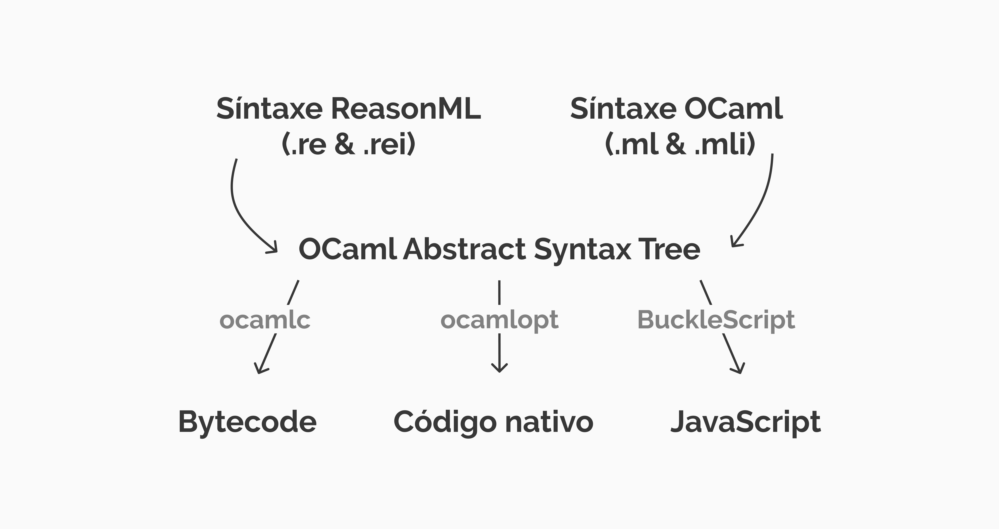

**NOTA:** _Antes de começar a falar sobre o tema do artigo, quero comunicar que esse artigo é
parte de uma série que irá falar sobre ReasonML e programação funcional_ 

# O que exatamente é ReasonML ?

### História

**ReasonML** ou carinhosamente **Reason** não é linguagem nova e sim nova síntaxe para a linguagem [OCaml](https://ocaml.org/).
Criada dentro do Facebook Reason é uma opção extremamente amigável a desenvolvedores JavaScript, pelo fato 
de que o mesmo traz uma síntaxe muito similar a linguagens `C-like`.

### Família ML

ReasonML e React não só compartilham da mesma incubadora, o Facebook, como também compartilham do mesmo criador
[Jordan Walke](https://github.com/jordwalke), que claramente tem fortes influências por linguagens da família [ML](http://www.mlworkshop.org/workshops/ml2018), Reason 
por ser uma extensão da sintaxe de OCaml, que de forma superficial pode se dizer que é um "filho" de [StandardML](https://pt.wikipedia.org/wiki/Standard_ML) e **React** 
que teve seus primeiros protótipos desenvolvidos também em **StandardML**.

### ReasonML e OCaml

OCaml como citada acima é uma linguagem de propósito geral já consolidada, com mais de 20 anos de desenvolvimento e evolução. Criada dentro da [Inria](https://www.inria.fr/en)
é uma linguagem que conta com um sistema de tipos poderoso e com um incrível suporte a inferência de tipos ([Hindley-Milner](https://en.wikipedia.org/wiki/Hindley%E2%80%93Milner_type_system)),
uma característica de linguagens da família ML. Pensando que ReasonML não é uma nova linguagem e sim apenas uma nova síntaxe, Reason desfruta 
dos benefícios desta linguagem robusta e madura, contando com features
já consolidadas como pattern matching, currying, variant types e entre outras que eu ou [Alesson]() vamos abordar de forma mais clara em um futuro artigo.

Reason compila para JavaScript com um código extremamente legível
através do projeto [BuckleScript](https://bucklescript.github.io/) e consequentemente pode ser utilizado de forma nativa
através do próprio OCaml, desta forma Reason tem acesso tanto ao ecossistema JavaScript ( Front-End e NodeJS ) através da interoperabilidade com a linguagem
e ao ecossistema OCaml na plataforma nativa. O diagrama abaixo representa bem como funciona o processo de compilação para JS 
e OCaml:  

  

### JSX

Reason possui de forma nativa suporte à [JSX](https://github.com/facebook/jsx), o que trouxe muitas possibilidades
ao Reason, já que JSX é essencial na hora de de desenvoler aplicações React. O suporte a JSX é responsável
pelo casamento entre Reason e React, aliás ambas tecnologias foram criadas pela mesma pessoa, não podíamos
esperar menos que isso.

# Síntaxe

## Variáveis

## Functions

# ReasonML para Front-End

## BuckleScript

## React

